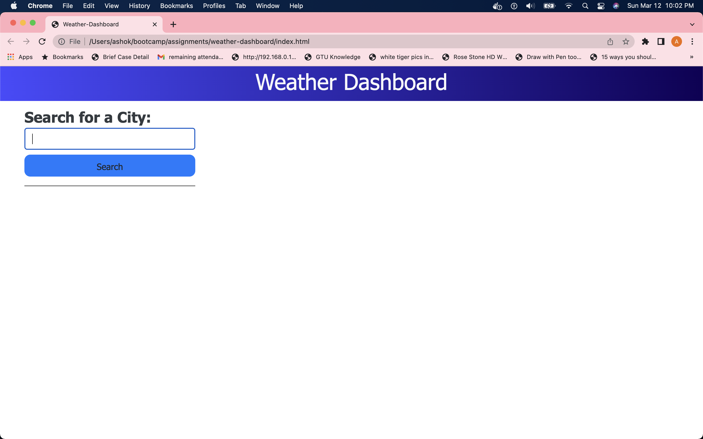
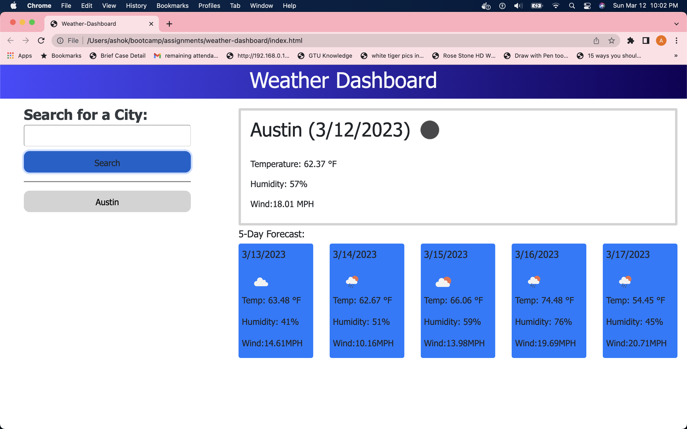
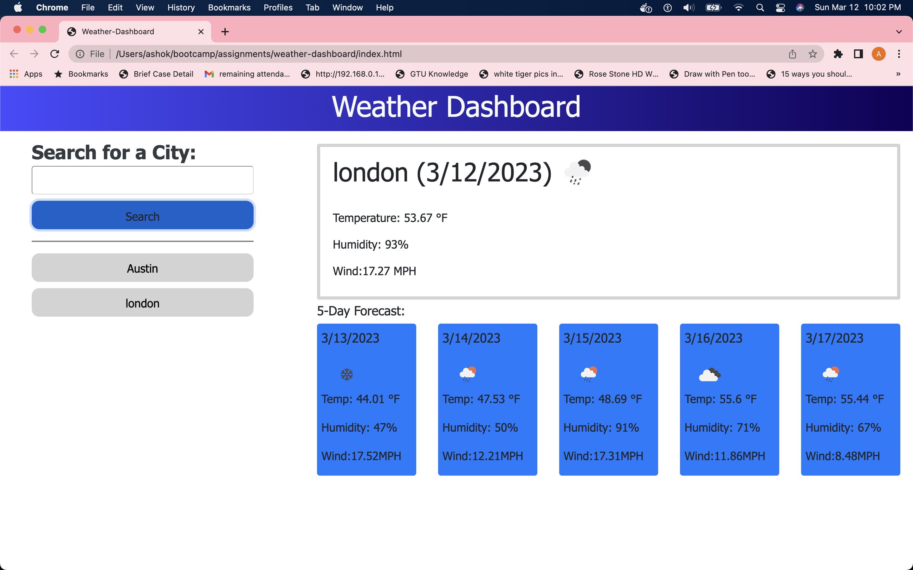
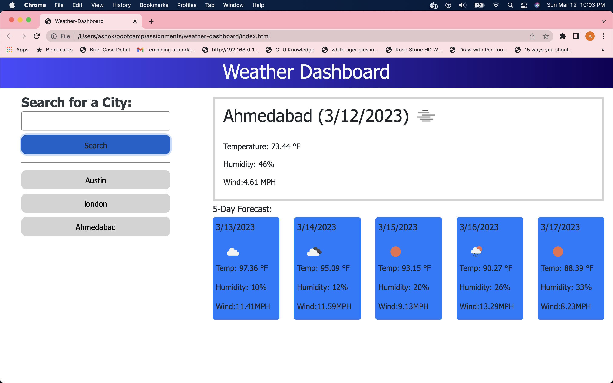
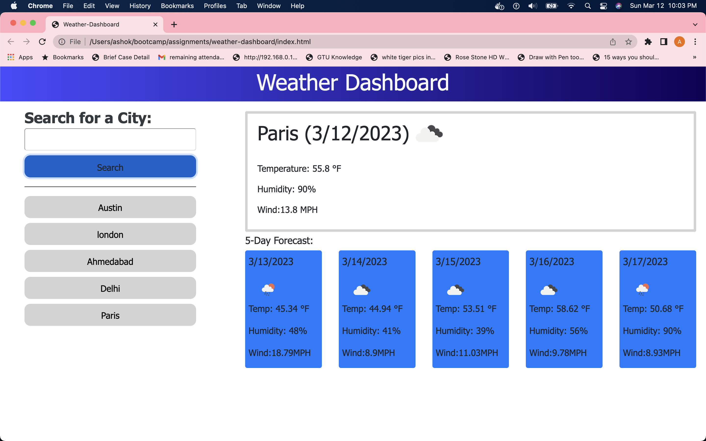
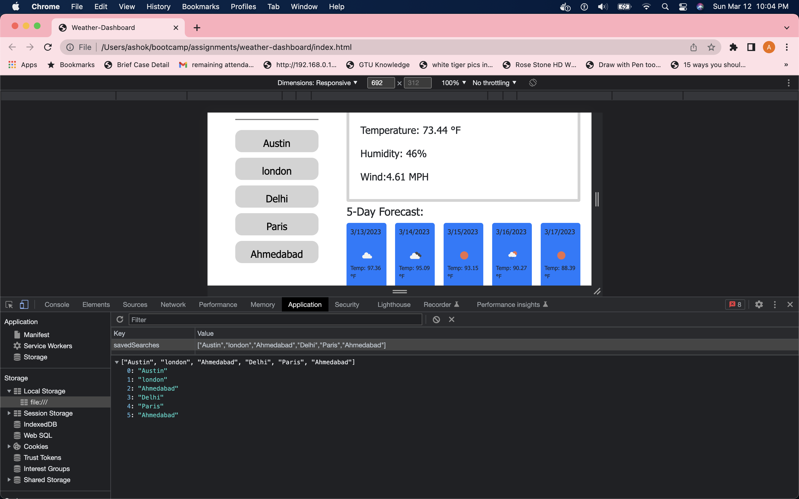
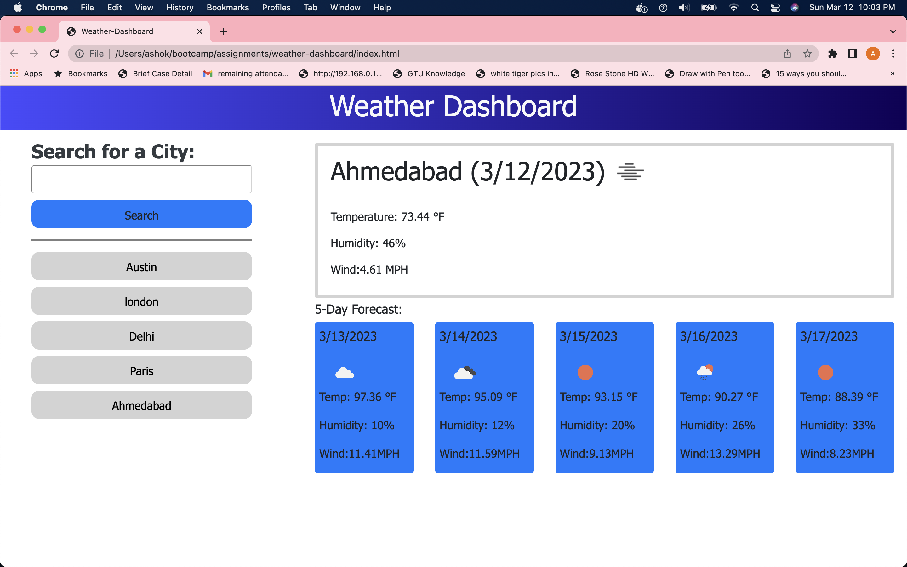
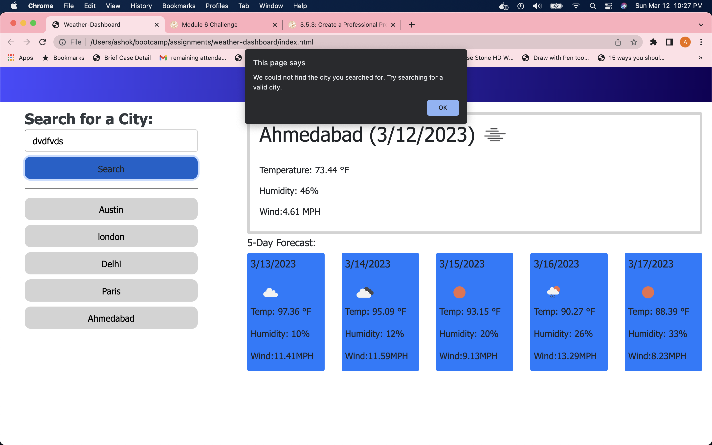

# weather-dashboard
weather dashboard website shows weather outlook for multiple cities.

## Description
weather dashboard application shows weather outlook of cities.so if user wants to plan a trip then its easy for user to see whats that particular city weather. In this application user can see 5days weather from current day. so user can plan trip according to weather.
I build this application using HTML,CSS,Javascript,Jquery,bootstrap and server side api concepts so through this application I also increase knowledge in frontend development part.

## Table of Contents

## Installation
N/A

## Usage
In weather dashboard application user can see search for city label and below one text box. when user enters proper city name in textbox then weather display on screen.here first on top of page user can see city name and current date and whats current weather.and below that its shows temperature,humidity and wind of current day.Below then its shoes 5day forecast so in that its display next 5 day weather.One advantage of this application is when user enter city name then its display below to serach button so again when user wants to see same city weather user just click on that city name so again user can see same city name weather. so no need to type again city name.here If user don't enter proper city name then alert message display like try seraching valid city name so if user enter wrong city name and spelling mistake happends its shows alert message.
Here I attached some screenshot of weather dashboard application and links.

1. The URL of the weather-dashboard functional, deployed application - https://avanijadeja.github.io/weather-dashboard/

2. The URL of the GitHub repository - https://github.com/avanijadeja/weather-dashboard

3. Scrrenshots of the weather-dashboard application.

# Credits
I used some javascript files from bootstrap, weather, for jquery and for day momemt functions.I read about this concepts from w3schools and my bootcamp classes.here I attached this links.

1. https:w3schools.com
2. https://stackpath.bootstrapcdn.com
3. https://cdnjs.cloudflare.com
4. https://code.jquery.com/jquery-3.4.1.min.js
5. https://cdnjs.cloudflare.com/ajax/libs/moment.js/2.24.0/moment.min.js

## License
Please refer to the LICENSE in the repo.

